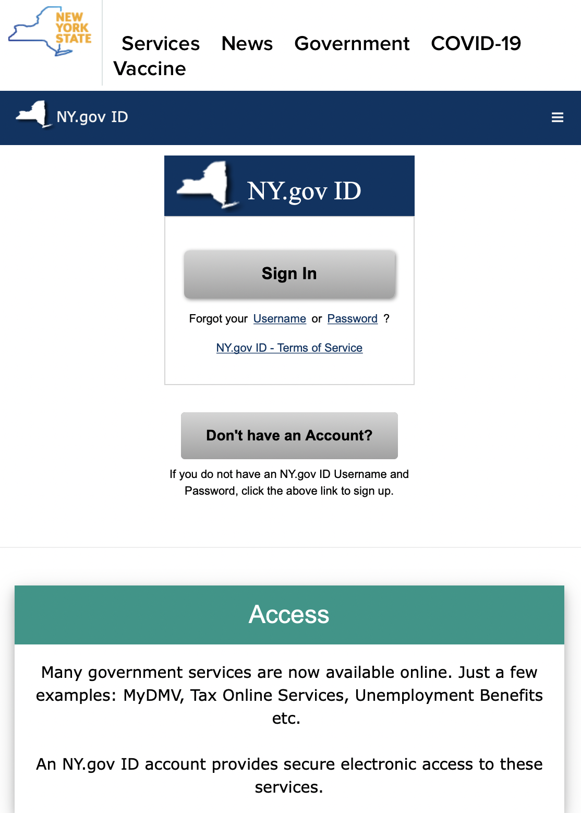

# Heuristic Evaluation of New York Government Websites
### Lana Garrett | DH101 | Fall 2021
## About the project
#### As the we have moved through history, we can see the great strides our world is making in the technological realm. These advances have unfortunately left members of our society in the dark as they feel they do not have access to or knowledge about these technologies. The most impacted group being our parents and grandparents. This impacts many aspects of their lives as they do day to day tasks, such as making calls, setting appointments, etc. Below I will give a heuristic evaluation of some of these goverment web services through the using severity rating as outlined [here](https://www.nngroup.com/articles/how-to-rate-the-severity-of-usability-problems/). This scale rates from 1-3 with 3 being the most severe and needing the most attention and fixing. Specifically, we will be looking at the New York ID website and the New York Coronavirus website, to see how usable and accessible these sites are to the older generations.
## [Nielsen's 10 Heuristics Explained](https://www.nngroup.com/articles/ten-usability-heuristics/)

### 1: Visibility of System Status 
Users know what their doing on a site as well as athe consquences and impact of their actions on the site.
### 2: Match Between System and Real World 
Design of the site should follow real world conventions, making information clearer for users.
### 3: User Control and Freedom
Users need a clear way to abandon actions that were made by mistake.
### 4: Consistency and Standards
Site should follow the same theme, layout, conventions, etc.
### 5: Error Prevention
Errors are often made when the site doesn't fit the user's mental model. In this case, users need to be presented with a confirmation option if they commit to an action.
### 6: Recognition Rather Than Recall
Have easily recognizable elements so users don't have to commit things about the interface to memory.
### 7: Flexibility and Efficiency of Use
Allow actions to be completed in multiple ways so the site is accessible to all users.
### 8: Aesthetic and Minimalist Design
Include only relevant content and features on a site so it is easy to navigate for users.
### 9: Help Users Recognize, Diadnose, and Recover From Errors
Tell users of the site why and error happened and provide suggestions on how to resolve the issue.
### 10: Help and Documentation
Give users a resource for extra help and assistamce.

# Site 1: [my.ny.gov](https://my.ny.gov)

#### Backrground Information: This site was set up to inform citizens of the rules and protocalls as well as genral info about getting a New York ID. This site proves to be useful as it also gives you access to many other government resources, such as unemployment benefits, Tax Services, the DMV, etc. 
## Heuristic Evaluation
### 1: Visibility of System Status 
#### The site is pretty straight forward when it comes to logging in, creating an account, and with menu options. The only downside is that users may be overwhelmed by all the resources available, especially those that are not expereinced with tehcnology. 
###### Severity Ratiting: 2. I would suggest less overall options to choose from to not confuse users. This can be done by making more generalized options for the drop down menu on the upper right hand side (horizontal 3 lines) with more extensive options within the generalized options themselves.
### 2: Match Between System and Real World 
#### There are not many symbols within the site itself, aside from the outline of the state New York.
###### Severity Ratiting: 3. I would suggest adding more easily identifiable icons, such as a question mark for the help tab, color diffirentiation between different tabs, etc.
### 3: User Control and Freedom
#### There is lots mof ways for the user to navigate this website that are quite intuitive to the general public, including those from the older generation, as most of the parts of the website are simple to navigate by simply clicking. With this being said, a new tab opens whenever a tab is clicked from the drop down menu wich may prove to be very confusing for most as you can not simply go back to your previous tab if you decide to click on another service.
###### Severity Ratiting: 2. I recommend changing the issue above so users can navigate in one single tab.
### 4: Consistency and Standards
#### The theme is consistant throughout the main site. Once you click on items from the drop down menu on the right hand side (three horizontal lines), the theme is slightly different in regards to color. The site swithces from primarily dark blue, a green shade, and white text to black text with lick blue backgrounds. This change in them is not consistant among all the options on the drop down menu.
###### Severity Ratiting: 3. I would recommend changing all the drop down menu options to the same theme as the general site to avoid any confusion among users and to present a cleaner look as well.
### 5: Error Prevention
#### There are red exlamation marks whenever an error is made. This is a very common symbol as well as color for mistakes.
##### Severity Ratiting: 1. This does not need any major changes. One suggestion would be to make the graphics slightly larger so they are more eye-cathcing to the user.
### 6: Recognition Rather Than Recall
#### As most of the information was presented in the same color and without any symbols. This would make it hard for a regular user to navigate the site with out having to recall where specific functions, which is exactly what a site should avoid.
##### Severity Ratiting: 3. I would recommend adding commonly recognized signs to multiple aspects of the site to help users easily recognize features and thus navigate the webiste. One place where I think this could be particularly useful in is the drop down menu on the upper right hand corner.
