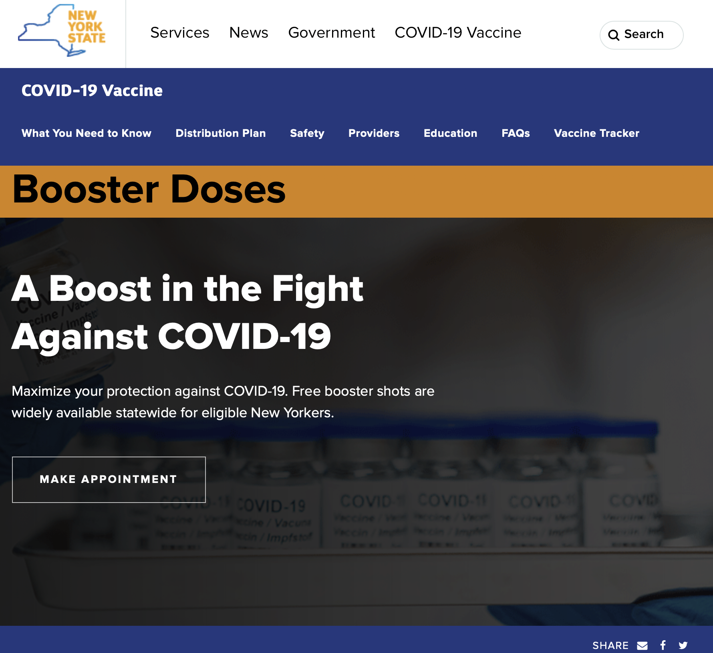

# Heuristic Evaluation of New York Government Websites
### Lana Garrett | DH101 | Fall 2021
## About the project
#### As the we have moved through history, we can see the great strides our world is making in the technological realm. These advances have unfortunately left members of our society in the dark as they feel they do not have access to or knowledge about these technologies. The most impacted group being our parents and grandparents. This impacts many aspects of their lives as they do day to day tasks, such as making calls, setting appointments, etc. Below I will give a heuristic evaluation of some of these goverment web services through the using severity rating as outlined [here](https://www.nngroup.com/articles/how-to-rate-the-severity-of-usability-problems/). This scale rates from 1-3 with 3 being the most severe and needing the most attention and fixing. Specifically, we will be looking at the New York ID website and the New York COVID-19 Vaccine portion of the New York Government website, to see how usable and accessible these sites are to the older generations.
## [Nielsen's 10 Heuristics Explained](https://www.nngroup.com/articles/ten-usability-heuristics/)

### 1: Visibility of System Status 
Users know what their doing on a site as well as the consquences and impact of their actions on the site.
### 2: Match Between System and Real World 
Design of the site should follow real world conventions, making information clearer for users.
### 3: User Control and Freedom
Users need a clear way to abandon actions that were made by mistake.
### 4: Consistency and Standards
Site should follow the same theme, layout, conventions, etc.
### 5: Error Prevention
Errors are often made when the site doesn't fit the user's mental model. In this case, users need to be presented with a confirmation option if they commit to an action.
### 6: Recognition Rather Than Recall
Have easily recognizable elements so users don't have to commit things about the interface to memory.
### 7: Flexibility and Efficiency of Use
Allow actions to be completed in multiple ways so the site is accessible to all users.
### 8: Aesthetic and Minimalist Design
Include only relevant content and features on a site so it is easy to navigate for users.
### 9: Help Users Recognize, Diadnose, and Recover From Errors
Tell users of the site why and error happened and provide suggestions on how to resolve the issue.
### 10: Help and Documentation
Give users a resource for extra help and assistamce.

# Site 1: [New York Governemnt IDs](https://my.ny.gov)

#### Backrground Information: This site was set up to inform citizens of the rules and protocalls as well as genral info about getting a New York ID. This site proves to be useful as it also gives you access to many other government resources, such as unemployment benefits, Tax Services, the DMV, etc. 
## Heuristic Evaluation
Overall Evaluation: Based off first impression, the website seems somewhat hard to navigate as all of the navigation tools and menu options look the same.
### 1: Visibility of System Status 
#### The site is pretty straight forward when it comes to logging in, creating an account, and with menu options. The only downside is that users may be overwhelmed by all the resources available within the drop down menu, especially those that are not expereinced with tehcnology. 
###### Severity Ratiting: 2. I would suggest less overall options to choose from to not confuse users. This can be done by making more generalized options for the drop down menu on the upper right hand side (horizontal 3 lines) with more extensive options within the generalized options themselves.
### 2: Match Between System and Real World 
#### There are not many symbols within the site itself, aside from the outline of the state New York.
###### Severity Ratiting: 3. I would suggest adding more easily identifiable icons, such as a question mark for the help tab, color diffirentiation between different tabs, etc.
### 3: User Control and Freedom
#### There are lots of ways for the user to navigate this website that are quite intuitive to the general public, including those from the older generation, as most of the parts of the website are simple to navigate by simply clicking. With this being said, a new tab opens whenever a option from the menu is selected  from the drop down menu. This may prove to be very confusing for most as you can not simply go back to your previous tab if you decide to click on an option from the menu.
###### Severity Ratiting: 2. I recommend changing the issue above so users can navigate in one single tab.
### 4: Consistency and Standards
#### The theme is consistant throughout the main site. Once you click on items from the drop down menu on the right hand side (three horizontal lines), the theme is slightly different in regards to color. The site swithces from primarily dark blue, a green shade, and white text to black text with lick blue backgrounds. This change in them is not consistant among all the options on the drop down menu.
###### Severity Ratiting: 3. I would recommend changing all the drop down menu options to the same theme as the general site to avoid any confusion among users and to present a cleaner look as well.
### 5: Error Prevention
#### There are red exlamation marks whenever an error is made. This is a very common symbol as well as color for mistakes.
###### Severity Ratiting: 1. This does not need any major changes. One suggestion would be to make the graphics slightly larger so they are more eye-cathcing to the user.
### 6: Recognition Rather Than Recall
#### As most of the information was presented in the same color and without any symbols. This would make it hard for a regular user to navigate the site with out having to recall where specific functions, which is exactly what a site should avoid.
###### Severity Ratiting: 3. I would recommend adding commonly recognized signs to multiple aspects of the site to help users easily recognize features and thus navigate the webiste. One place where I think this could be particularly useful in is the drop down menu on the upper right hand corner.
### 7: Flexibility and Efficiency of Use
#### The site was easy to navigate since most portals are listed by name in the drop menu. THe inclusion of symbols, however, would make the site much easier. There is also many portals on the site that could stand alone on their own site. Another solution is taking away the drop down menu all together and putting these options directly on the sites well
###### Severity Rating: 2. While the site is easy to navigate off reading alone, the inclusion of widely accepted symbols would make this navigation process much easier. I would also recommend making separate sites for some of the reasources, such as Unemployment Benefits, since this is something heavily used by the general public with the ongoing pandemic.
### 8: Aesthetic and Minimalist Deisgn
#### There definitely needs to be some added color to differentiate between actions and menu options on the site. The way the site is currently set up overwhelms the user as they can not easily find what they are looking for without reading through the options listed.
###### Severity Rating: 3. The website needs the addition of multiple colors to the theme of the site as it is very hard to distinguish tools as the site currently is. I recommend the putting names of the resources within the options of dropdown menu (Online Resources, FAQs, etc.) in bold to distinguish from the information that follows. The addition of different different fonts for titles might be useful as well.
### 9: Help Users Recognize, Diadnose, and Recover From Errors
#### There are not many error notifications as the site is mainly informative at a glance. Error messages pop up when you attempt to sign in or create an account with the generic symbols and message.
###### Severity Rating: 1. Nothing needs to be changed about the error messages.
### 10: Help and Documentation
#### There is no clear help page. There is the inclusion of a FAQs page which can serve as a help page in some cases since this site is mainly informative.
###### Severity Rating: 3. I would recommend the inclusion of a dedicated help tab as well as a way for users to search for their specific question or topic.

# Site 2: [COVID-19 Vaccine New York](https://covid19vaccine.health.ny.gov/booster-doses)

#### Backrground Information: This site was set up to inform citizens of New York about open and operating vaccination sites. The site also provides general information about the vaccineas as well as the booster shot. 
## Heuristic Evaluation
Overall Evaluation: Based off first impression, the website seems very informative. The site also seems hard to navigate as the only thing you initially see on the homepage is how to make an appointment. This, however, may have been intentional as the governemtn advocates for the general public to get vaccinated.
### 1: Visibility of System Status 
#### The site is very forward in its main purpose, vaccination appointments. All other information is somewhat hidden.
###### Severity Rating: 2. The site should include some informative resources directly below the button to make appointments so users can be informed briefly before scheduling their vaccine. Having all other info on the left hand side menu (horizontal 3 lines) is good as these are the two main things the public would want to know when making a vaccine appointment.
### 2: Match Between System and Real World
#### There are not many symbols on the site aside from the outline of New York as well as generic social media symbols for sharing information and resources.
###### Severity Rating: 2. I would suggest the addition of symbols to the site to help users easily get to where they need to go. This could include a calendar symbol by the appointment button.
### 3: User Control and Freedom
#### There are to many dorp down menus on the site which proves to be confusing. There is s drop down menu on the left hand side as well as the right hand side and both can be open at the same time.
generic social media symbols for sharing information and resources.
###### Severity Rating: 3. This makes the website very confusing and overwhelming. I suggest taking away one of the menus and consolidating to one clear menu tab.
### 4: Consistency and Standards
#### There is a clear theme across the website and all of its various resources. When taking a further look and clicking on tabs such as "What You Need to Know" under the "A Boost in the Fight" section we start to see some weird spacing. Once we are redirected to the page there is a huge unecessary block of color, and in some cases an image, following the title. This takes up almost the entire page and happens with spacing as you proceed trough the page.
###### Severity Rating: 2. While the spacing is not a functional issue it does take away from the efficiency and user-friendly nature of the site. I would suggest removing all unecessary spacing from all parts of the site.
as the general site to avoid any confusion among users and to present a cleaner look as well.
### 5: Error Prevention
#### As this is a mainly informative site there were not many places to encounter an error. The error messages I did find were in the "New York State Vax and Win!" tab within. This displayed generic eroor messages such as a triangle with an exclamation point and a message that reads, "There was an error on your page. Please corract any fields and submit again". This was followed by a link that takes you to your first mistake so you can correct it.
###### Severity Rating: 1. My recommendation to improve the error messages would be to make the red darker of the message darker and make the triangles red as well so they are more eye catching to the user.
### 6: Recognition Rather Than Recall
#### Most of the site was informative so there are not many opportunities for the user's brain to recall information. 
###### Severity Rating: 3. I recommend the addition of basic symbols that the user can easily identify so the page is easier to navigate. Although the site is mainly informative, this would make the experience much easier for any user so they do not have to recall where every resource is on the website. These symbols could be something as simple as a book next to the resources tab or a calendar next to the appoinment button.
### 7: Flexibility and Efficiency of Use
#### This website was insanely hard to navigate as an experienced tech user myself as I was overwhelmed with information and could not remember where anything was located.
###### Severity Rating 3. I suggest majorly reworking the website into a few very generic sections that contain all the various resources and what they are explicitly within these options. The site currently has all its resources burried within each other and it proves to be very difficult when navigating.
### 8: Aesthetic and Minimalist Deisgn
#### The website is very overwhelming with all the different menus and resources but does keep a consistent theme throughout.
###### Severity Rating 2. I would suggest editing the number of resources and menu options available to make the layout more minimalistic and easy to navigate for the user.
### 9: Help Users Recognize, Diadnose, and Recover From Errors
#### When I encountered an error message I knew exactly why as well as where and how to fix it.
###### Severity Rating: 1. Nothing needs to change about the error messages or the way the user recovers from error.
### 10: Help and Documentation
#### There is a search bar but it is hidden in one of the two menu bars.
###### Severity Rating 3. I would suggest adding a search bar on the main page of the site as this is usually where users go to when they want to locate something on the site.
